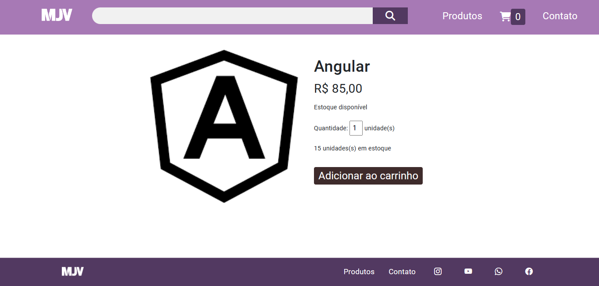

 <h1 align="center"> 🛍️E-commerce
 </h1>

## 📝Descrição

Este é um projeto para site e-commerce de cursos, com objetivo de mostrar as tecnologias mais utilizadas no mercado e, ser uma plataforma fácil de usar intuitiva para o usuário final.

 <h1 align="center"> Produtos
 </h1>
 


 <h1 align="center"> Descrição dos produtos
 </h1>



 <h1 align="center"> Carrinho
 </h1>


<h1 align="center"> Contato
 </h1>


[Clique aqui](https://mjv-school-angular-angular-ecommerce.vercel.app) para acessar o deploy do projeto

### ✅ O que funciona

- Buscar produtos
- Carrinho de compras

### ❌ O que não funciona

- Contato

#### 🚀Tecnologias utilizadas

<div>


## <h2>🔄Entre no diretório para criar projeto</h2>

```bash
  ng new projeto
```

```bash
  cd projeto
```
----

[Roberta Vieira de Melo](https://github.com/VieiraMeloRoberta)
